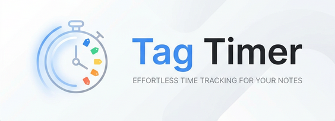

<p align="center">
  
</p>

# Tag Timer

A minimal, high-performance Obsidian plugin for adding inline timers and countdowns directly into your notes.

This version is a complete redesign focused on **efficiency**, **zero dependencies**, and a **premium user experience**.

## Features

- **Lightning Fast Interaction:**
  - `Alt+S`: Toggle Timer (Start / Pause / Resume)
  - `Alt+C`: Toggle Countdown (Start / Pause / Resume)
  - `Alt+D`: Delete Timer
- **Countdowns & Stopwatches:** Choose between simple stopwatches or goal-oriented countdowns.
- **Clickable Widgets:** Interactive badges in both **Live Preview** and **Reading View**. Simple click to toggle, right-click for the context menu.
- **Rich Context Menu:** Right-click any timer to access Stop, Reset, Delete, or even **Change Time** manually.
- **Auto-Restore & Crash Protection:** Running timers are automatically paused upon plugin unload and recovered when restarted. Safe across devices and through app crashes.
- **One Timer Per Line:** Enforces a clean layout by preventing multiple timers on the same line.
- **Native Integration:** Uses Obsidian's internal CSS variables to perfectly adapt to your theme (Light/Dark).
- **Zero External Dependencies:** Built with pure TypeScript and CodeMirror 6 for maximum stability and speed.

## Usage

### Hotkeys & Interactions

Position your cursor anywhere on a line with a timer, or interact directly with the badge:

- **Toggle (Stopwatch):** `Alt+S` or click the badge.
- **Toggle (Countdown):** `Alt+C` or click the badge.
- **Delete:** `Alt+D`.

### Timer States

1. **Running (⌛/⏳):** Actively ticking. The icon animates to show progress.
2. **Paused (⏳):** Temporarily halted. Resuming picks up from the last recorded time.
3. **Stopped (⏹️):** Archive state. Retains the final time. Resuming a stopped stopwatch starts from `0s`; resuming a stopped countdown restarts from the target duration.

### Editing Time

Need to adjust the time? Use the **Change time** command or right-click the badge to open the Time Modal. It accepts `mm:ss`, `hh:mm:ss`, or simple numbers for minutes.

## Developer Information

### Architecture
- **Rendering:** Uses CodeMirror 6 `ViewPlugin` and `WidgetType` for efficient, non-destructive UI overlays.
- **Data Storage:** Timers are stored as small, text-based tags in your markdown: `⏳[id|kind|state|elapsed|startedAt|target]`.
- **State Management:** A lightweight registry tracks running timers across files to ensure reliable recovery.

### Build Instructions
This project uses [Bun](https://bun.sh/) for lightning-fast builds.

```bash
# Install dependencies
bun install

# Development mode (watch)
bun dev

# Production build
bun run build
```

## License

MIT License. Developed by [quantavil](https://github.com/quantavil).
